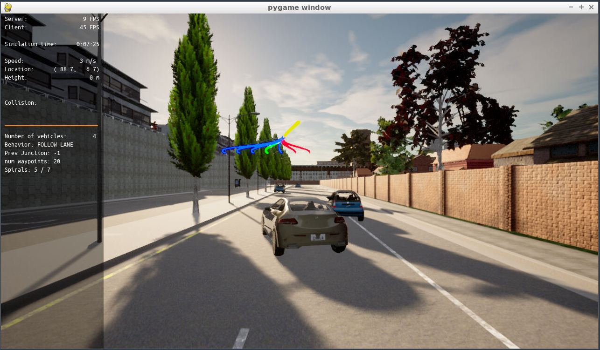
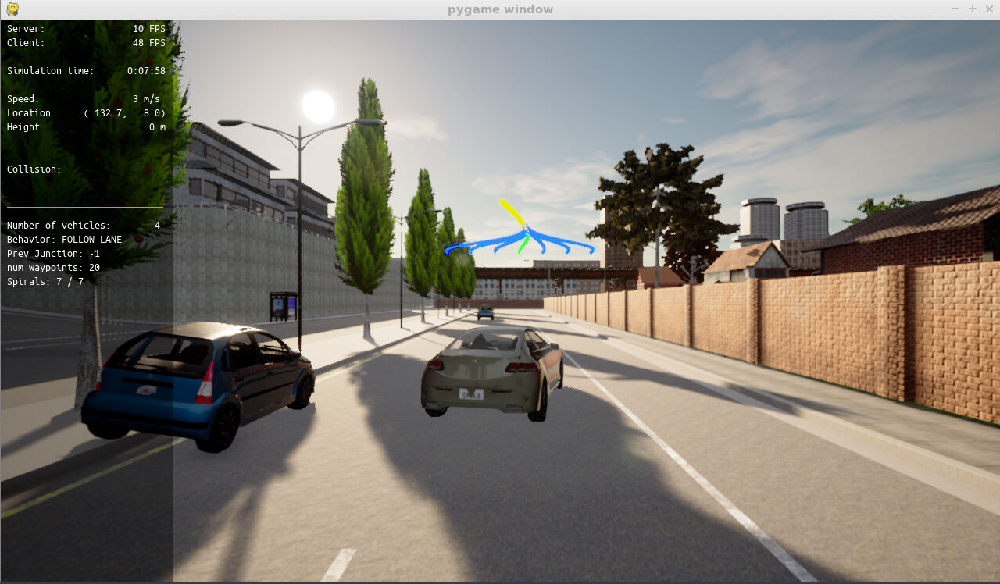
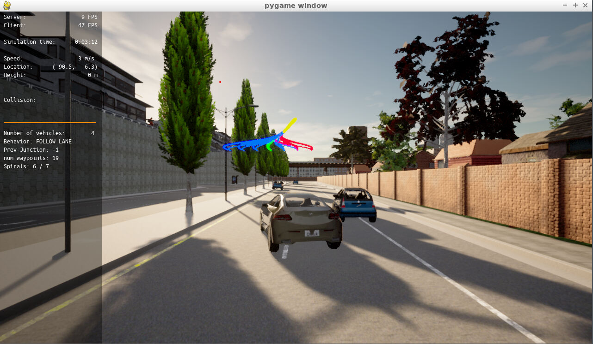
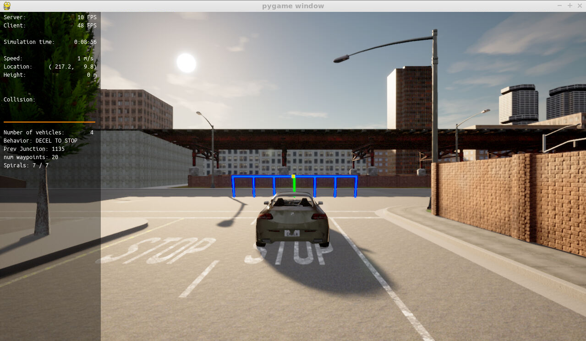

# Motion Planning and Decision Making for Autonomous Vehicles

This project utilizes Finite State Machines and Cubic Spiral based Trajectory Planning to drive a simulation of a self driving vehicle.

